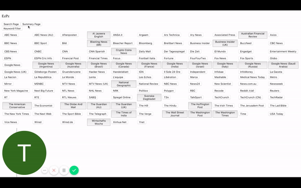
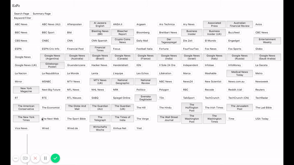
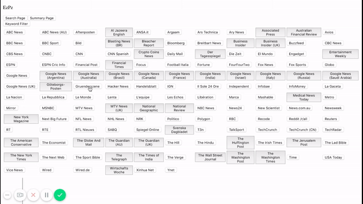
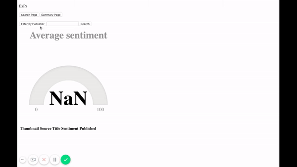

# Propoganda Bonanza

## Description

Find out the average sentiment of your favorite news website's top articles.

## Installation

**API keys** are necessary to access the correct information. Both keys required can be retrieved for free.

The [**News API**](https://newsapi.org/) allows developers to access their API for free. Get a key [here](https://newsapi.org/register)

[**Microsoft Azure**](https://azure.microsoft.com/en-us/) provides a free (up to 5000 requests) text analysis API. For more information on text/sentiment analysis please visit [here](https://docs.microsoft.com/en-us/azure/cognitive-services/text-analytics/how-tos/text-analytics-how-to-sentiment-analysis). To obtain an API key please visit [here](https://azure.microsoft.com/en-us/services/cognitive-services/text-analytics/), a credit card is not required for the 7 day free trial.

Once both API keys have been obtains close the repo and:

1. Install modules

```
$ npm install
```

2. Set environment variables

```
$ export AZURE_APIKEY="YOUR MICROSOFT AZURE API KEY HERE"
$ export NEWS_APIKEY="YOUR NEWS API KEY HERE"
```

3. Start the application

```
$ npm start
```

4. Navigate to http://localhost:3001/

## Page Navigation

The page is set to load the summary page. To navigate to the search page simply click the search page button at the top left.

To go back to the summary page click the summary page button at the top left.



## Summary Page

The summary page has a list of available news sources to select from. Clicking a news sorce button will add the top stories average sentiment to the graph.



_Filtering_ is as easy as clicking the Keyword Filter button located at the top left. Once the input field reveals itself enter in the keyword you wish to filter by. Once the word is in the field, clicking on a news source button will retrieve the average sentiments of articles containing that keyword.



## Search Page

To see the average sentiment of ALL sources on a given topic, enter a keyword into the search field and hit search. You will be shown the average sentiment as well as a list of the top articles relating to that topic.


_Filtering_ by source will limit your results to a single source. Simply click the Filter by Publisher button and search by a keyword.



## Results and Disclaimer

The way this app works is by taking a brief description of a news article retrieved by the News API and forwarding those results to Microsoft Azure's text analytics API. Many descriptions might be incomplete or provide insufficient data for Azure's analytics to report a sentiment. By default Azure's analytics API reports back a 50. This means the article is either perfectly neutral or the test was inconclusive. More information on this [here](https://docs.microsoft.com/en-us/azure/cognitive-services/text-analytics/how-tos/text-analytics-how-to-sentiment-analysis)
